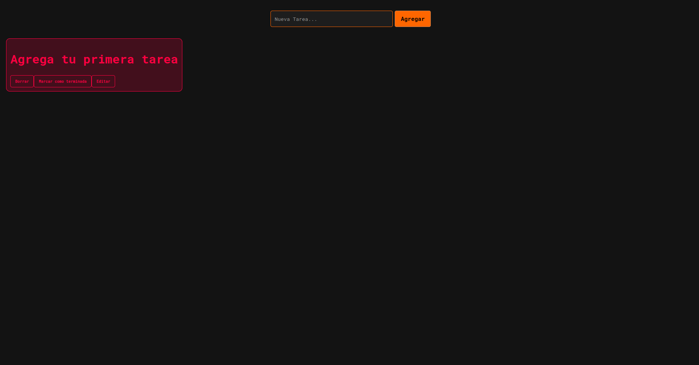

# To-Do List

Este proyecto es una simple aplicación de lista de tareas (To-Do List) creada con HTML, CSS y JavaScript. Permite a los usuarios agregar, eliminar y marcar tareas como completadas.

## Características

- Agregar nuevas tareas.
- Marcar tareas como completadas.
- Eliminar tareas.


## Tecnologías utilizadas

- **HTML**: Estructura de la página.
- **CSS**: Estilos de la aplicación.
- **JavaScript**: Lógica de la aplicación y manipulación del DOM.

## Captura de pantalla



## Instalación

1. Clona este repositorio:
   ```bash
   git clone https://github.com/tu_usuario/TodoList-JS.git
